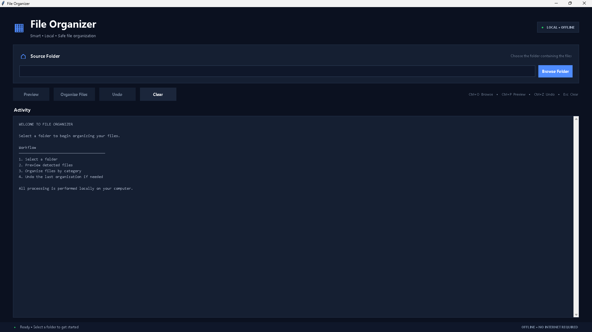
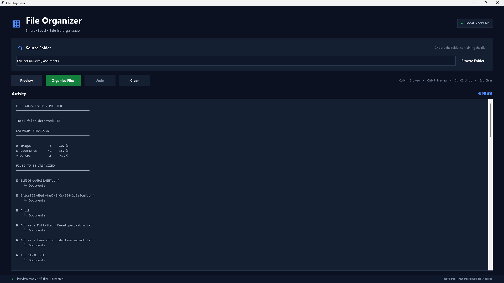
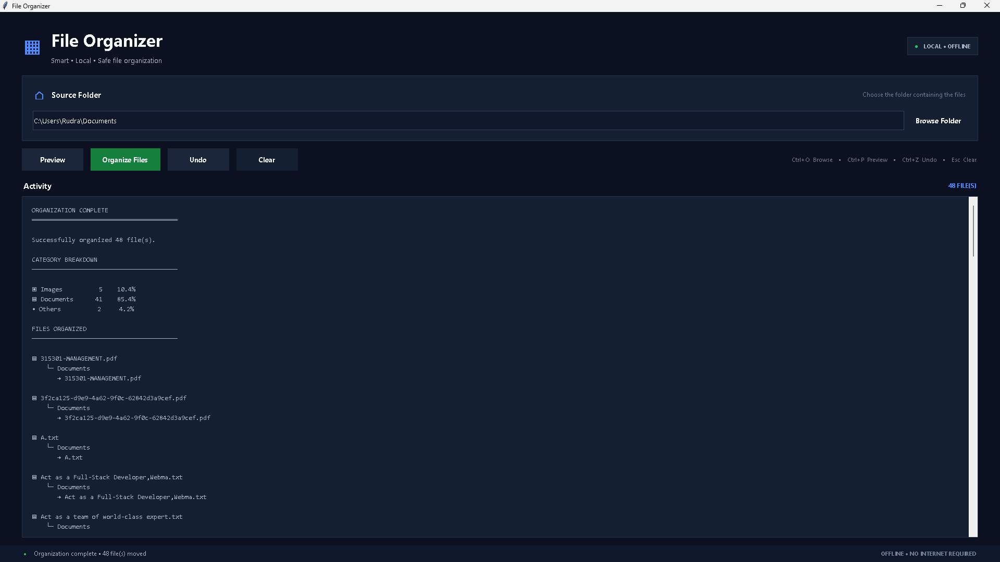
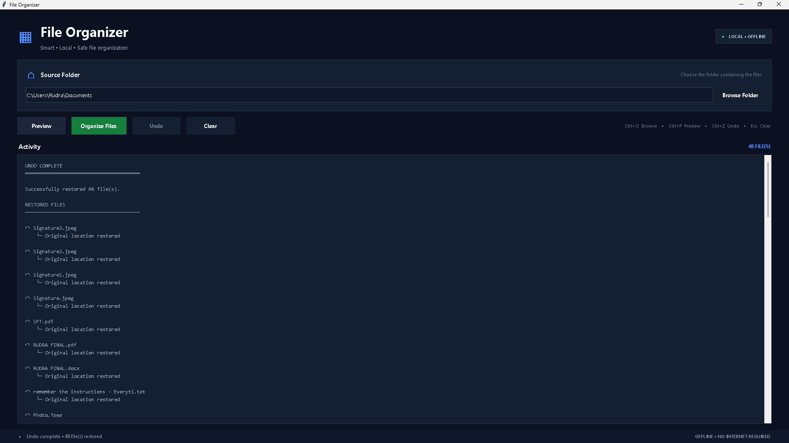

# Python File Organizer

A lightweight desktop application built with **Python and Tkinter** that automatically organizes files into categorized folders based on their file extensions.

The application provides a clean graphical interface for selecting a folder, previewing its contents, organizing files safely, and undoing the most recent organization operation.

It is designed to be **simple, offline, dependency-free at runtime, and safe against accidental file overwrites**.

> **Latest stable release: v1.0.0**

---

## ✨ Features

* 🖥️ Clean graphical desktop interface
* 📁 Select any local folder
* 👀 Preview files before organizing
* 🗂️ Automatic file categorization
* 🔒 Safe duplicate filename handling
* ↩️ Undo the most recent organization operation
* 📦 Supports multiple common file types
* ❓ Unknown file types are placed in `Others`
* 🛡️ Prevents accidental overwriting of existing files
* 🔄 Rollback protection if organization encounters a filesystem error
* ⚡ Fast extension-based categorization
* ⌨️ Keyboard shortcuts
* 🌐 No internet connection required
* 📦 No third-party runtime packages required
* 🧪 Automated test suite
* 🪟 Windows standalone executable available
* 🌙 Premium dark-themed graphical interface

---

## 🖼️ Screenshots

### Main Window



### File Preview



### Organized Files



### Undo Operation



---

## 📥 Download

### Windows

The latest stable Windows release is:

**File Organizer v1.0.0**

Download the Windows ZIP from the project's **GitHub Releases** page:

**`FileOrganizer-v1.0.0-Windows.zip`**

### Installation

1. Download `FileOrganizer-v1.0.0-Windows.zip`.
2. Extract the ZIP file.
3. Open the extracted `FileOrganizer` folder.
4. Run:

```text
FileOrganizer\FileOrganizer.exe
```

No Python installation is required for the standalone Windows release.

---

## 📂 File Categories

| Category            | Examples                                                                                                            |
| ------------------- | ------------------------------------------------------------------------------------------------------------------- |
| **Images**    | `.jpg`, `.jpeg`, `.png`, `.gif`, `.bmp`, `.webp`, `.svg`, `.ico`, `.tiff`, `.tif`               |
| **Documents** | `.pdf`, `.doc`, `.docx`, `.txt`, `.rtf`, `.odt`, `.xls`, `.xlsx`, `.csv`, `.ppt`, `.pptx`     |
| **Videos**    | `.mp4`, `.mkv`, `.avi`, `.mov`, `.wmv`, `.flv`, `.webm`, `.m4v`                                     |
| **Music**     | `.mp3`, `.wav`, `.aac`, `.flac`, `.ogg`, `.m4a`, `.wma`                                               |
| **Archives**  | `.zip`, `.rar`, `.7z`, `.tar`, `.gz`, `.bz2`, `.xz`                                                   |
| **Programs**  | `.exe`, `.msi`, `.bat`, `.cmd`, `.sh`, `.py`, `.c`, `.cpp`, `.java`, `.js`, `.html`, `.css` |
| **Others**    | File types not recognized by the organizer                                                                          |

---

## 🖥️ Application Workflow

The application follows a simple workflow:

```text
Select Folder
     ↓
Preview Files
     ↓
Review Categories
     ↓
Organize Files
     ↓
Confirm Operation
     ↓
Files Moved Safely
     ↓
Undo if Required
```

---

## 🔍 Preview

Before moving anything, the application can generate a preview showing:

* Total number of files
* Number of files in each category
* Individual filenames
* The category assigned to each file

Example:

```text
File Organization Preview
=========================

Total files: 5

Category Summary
----------------
Images       1
Documents    1
Music        1
Videos       1
Others       1

Files
-----

photo.jpg
    → Images

document.pdf
    → Documents

song.mp3
    → Music
```

The preview does **not** modify any files.

---

## 🔒 Duplicate Filename Handling

Existing files are never overwritten.

If a destination already contains:

```text
photo.jpg
```

the organizer automatically generates:

```text
photo_1.jpg
```

If that also exists:

```text
photo_2.jpg
```

and so on until an available filename is found.

This prevents accidental data loss and is covered by the automated test suite.

---

## ↩️ Undo

The application records the most recent organization operation during the current application session.

After organizing files, **Undo** can restore the moved files to their original locations.

### Important

* Only the most recent organization operation can be undone.
* Undo history exists only during the current application session.
* Undo history is not persisted after closing the application.
* Existing files at the original location are never overwritten.
* If an undo conflict occurs, the application avoids overwriting the existing file.

---

## 🛡️ Safe File Operations

The organizer is designed to avoid destructive file operations.

### Existing destination files

Existing files are never overwritten.

### Organization failure

If a filesystem error occurs after some files have already been moved, the application attempts to roll back previously completed moves.

### Undo conflicts

If a file already exists at its original location, the organizer does not overwrite it.

---

## ⌨️ Keyboard Shortcuts

| Shortcut     | Action                  |
| ------------ | ----------------------- |
| `Ctrl + O` | Select folder           |
| `Ctrl + P` | Preview files           |
| `Ctrl + Z` | Undo last organization  |
| `Esc`      | Clear current selection |

---

## 📋 Requirements

### Running from source

* Windows, Linux, or macOS
* Python 3.13 or compatible Python 3 version
* Tkinter

The application uses Python's standard library for runtime functionality.

No third-party Python packages are required to run the source version.

### Development / Testing Requirements

The project uses:

* `pytest` for automated tests
* `PyInstaller` for Windows executable builds

These packages are only required for development, testing, and packaging.

---

## 🚀 Running from Source

Clone or download the repository and open a terminal in the project root.

Run:

```powershell
python src\main.py
```

The File Organizer window will open.

---

## 📖 Basic Usage

1. Launch the application.
2. Click **Browse Folder**.
3. Select the folder you want to organize.
4. Click **Preview**.
5. Review the detected categories and files.
6. Click **Organize Files**.
7. Confirm the operation.
8. Files are moved into their category folders.
9. Use **Undo** if you want to restore the most recent operation.
10. Use **Clear** to reset the current folder selection.

---

## 🪟 Windows Standalone EXE

A standalone Windows executable is generated using **PyInstaller**.

The release uses PyInstaller's **one-folder distribution** format:

```text
dist/
└── FileOrganizer/
    ├── _internal/
    └── FileOrganizer.exe
```

The complete `FileOrganizer` folder must remain intact because the executable depends on the files contained inside `_internal`.

The application can then be launched without manually running Python.

---

## 🏗️ Building the Windows EXE

### Install PyInstaller

```powershell
python -m pip install pyinstaller
```

### Build using the project specification

From the project root:

```powershell
python -m PyInstaller --clean --noconfirm FileOrganizer.spec
```

The executable will be generated inside:

```text
dist\FileOrganizer\FileOrganizer.exe
```

### Build Output

The project uses:

```text
FileOrganizer.spec
```

to define the PyInstaller build configuration.

Generated build files are intentionally excluded from Git using `.gitignore`.

---

## 📦 Creating the Windows Release ZIP

After successfully building the application:

```powershell
Compress-Archive -Path .\dist\FileOrganizer -DestinationPath .\FileOrganizer-v1.0.0-Windows.zip -Force
```

The resulting release package is:

```text
FileOrganizer-v1.0.0-Windows.zip
```

The ZIP contains the complete standalone application directory.

---

## 🧪 Testing

The project uses **pytest** for automated testing.

Run the complete test suite:

```powershell
python -m pytest
```

### Current Test Result

```text
============================= test session starts =============================

platform win32 -- Python 3.13.15
pytest-9.1.1
pluggy-1.6.0

collected 28 items

tests\test_organizer.py ............................ [100%]

============================== 28 passed ==============================
```

### Current Test Status

**28 / 28 tests passed**

The test suite covers:

* File type categorization
* Uppercase extensions
* Unknown extensions
* Compound extensions
* Folder scanning
* Empty folders
* Invalid paths
* Unique filename generation
* Duplicate filenames
* File organization
* Organization results
* Undo operations
* Missing undo destinations
* Protection against overwriting existing files

---

## 🔎 Syntax / Compilation Check

Python source files can also be checked using:

```powershell
python -m compileall src tests
```

A successful compilation indicates that the Python source files compile without syntax errors.

---

## 🧪 Release Validation

The v1.0.0 release was validated through multiple stages.

### Source Application

* ✅ GUI launched successfully
* ✅ Folder browsing tested
* ✅ File preview tested
* ✅ File organization tested
* ✅ Category handling tested
* ✅ Duplicate filename handling tested
* ✅ Undo tested
* ✅ Clear functionality tested
* ✅ Keyboard shortcuts tested
* ✅ Closing and reopening tested

### Automated Tests

```text
28 / 28 tests passed
```

### Standalone Executable

* ✅ PyInstaller build completed successfully
* ✅ Windows executable launched successfully
* ✅ Standalone application tested
* ✅ Clean-release ZIP tested outside the development project

### Clean Environment Test

The released ZIP was downloaded and tested as a normal user would use it:

```text
GitHub Release
      ↓
Download ZIP
      ↓
Extract ZIP
      ↓
FileOrganizer\FileOrganizer.exe
      ↓
Application launched successfully
```

This validates the distributed release rather than only the development environment.

---

## 🏗️ Project Structure

```text
Python-File-Organizer/
│
├── assets/
│   └── screenshots/
│       ├── main-window.png
│       ├── preview.png
│       ├── organized-files.png
│       └── undo.png
│
├── src/
│   ├── main.py
│   ├── gui.py
│   └── organizer.py
│
├── tests/
│   └── test_organizer.py
│
├── .gitignore
├── FileOrganizer.spec
└── README.md
```

### Source Files

#### `src/main.py`

Application entry point.

Starts the graphical user interface.

#### `src/gui.py`

Contains the Tkinter graphical interface.

Responsible for:

* Folder selection
* Preview generation
* Organization controls
* Undo controls
* Clear controls
* Status messages
* Results display
* User confirmations
* Keyboard shortcuts
* Application lifecycle

#### `src/organizer.py`

Contains the core file-management logic:

* File categorization
* Extension lookup
* Folder scanning
* Unique filename generation
* File organization
* Rollback handling
* Undo operations

#### `tests/test_organizer.py`

Contains automated tests for the organizer logic.

---

## ⚙️ Technical Design

The project separates the graphical interface from the core file-management logic.

```text
                 ┌─────────────────┐
                 │    main.py      │
                 │ Application     │
                 │  Entry Point    │
                 └────────┬────────┘
                          │
                          ▼
                 ┌─────────────────┐
                 │     gui.py      │
                 │   Tkinter GUI   │
                 └────────┬────────┘
                          │
                          ▼
                 ┌─────────────────┐
                 │  organizer.py   │
                 │ Core File Logic │
                 └────────┬────────┘
                          │
                          ▼
                 ┌─────────────────┐
                 │   File System   │
                 └─────────────────┘
```

File categorization uses a precomputed extension lookup table so each file can be categorized directly without repeatedly scanning every category.

---

## 🎯 Design Goals

The project intentionally focuses on being:

* **Simple**
* **Useful**
* **Offline**
* **Fast**
* **Safe**
* **Maintainable**
* **Easy to understand**
* **Easy to test**
* **Dependency-free at runtime**
* **Protected against accidental overwrites**

---

## ⚠️ Limitations

* Undo only applies to the most recent organization operation.
* Undo history is not saved after closing the application.
* Files are categorized using their extensions.
* Files inside subdirectories are not recursively organized.
* Organization operates only on files directly inside the selected folder.
* The application does not automatically monitor folders for new files.

---

## 🧰 Technologies

* **Python 3.13**
* **Tkinter**
* **pathlib**
* **shutil**
* **collections.Counter**
* **pytest**
* **PyInstaller**

### Runtime Dependencies

No external runtime dependencies are required.

The application uses Python's standard library for its core functionality.

---

## 📌 Project Status

**Version:** `1.0.0`

**Status:** Stable

**Platform:** Windows for the standalone release

### v1.0.0 Validation

The current release has been:

* ✅ Compiled successfully
* ✅ Tested with **28 automated tests**
* ✅ Manually tested through the graphical interface
* ✅ Built successfully with **PyInstaller 6.22.2**
* ✅ Built using **Python 3.13.15**
* ✅ Tested on **Windows 11**
* ✅ Tested as a standalone executable
* ✅ Packaged as a Windows ZIP release
* ✅ Downloaded and tested from the GitHub Release
* ✅ Tested from a clean location outside the development project

---

## 📄 License

This project is currently intended for **educational and personal use**.

No formal open-source license is currently included with the repository.

If you plan to allow others to freely modify, distribute, or reuse the project, add an appropriate open-source license such as the MIT License.
